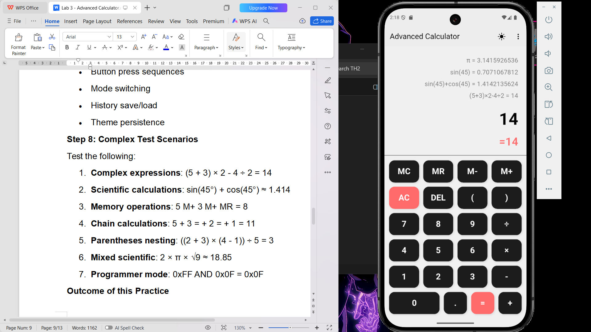
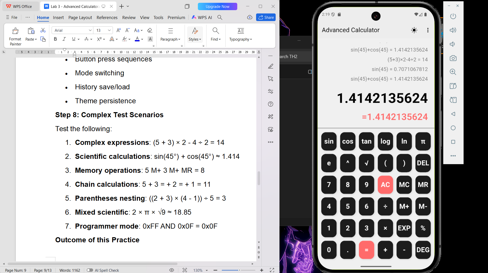
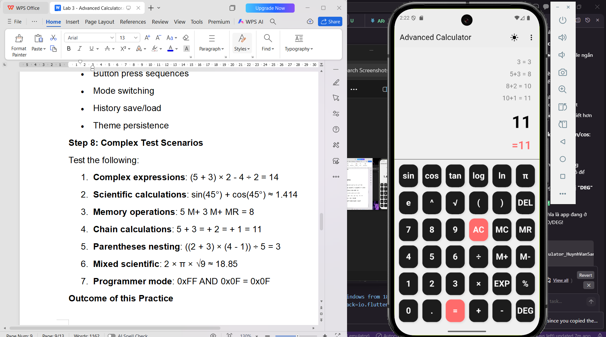
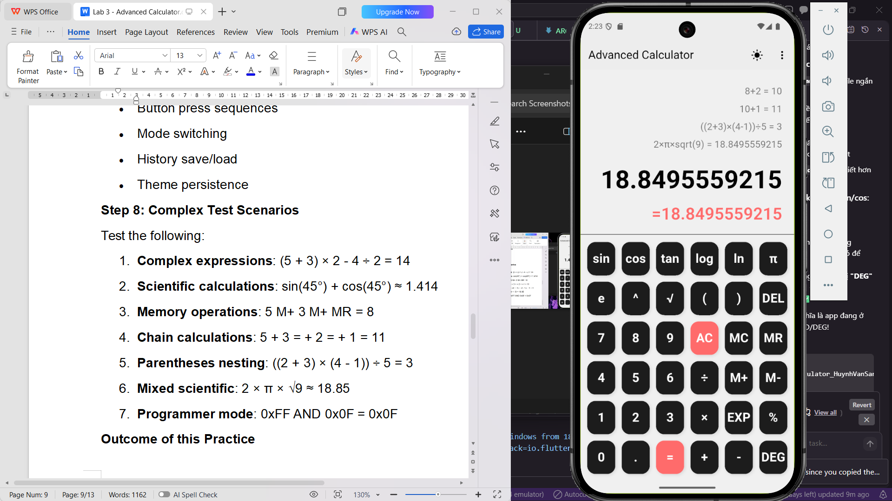
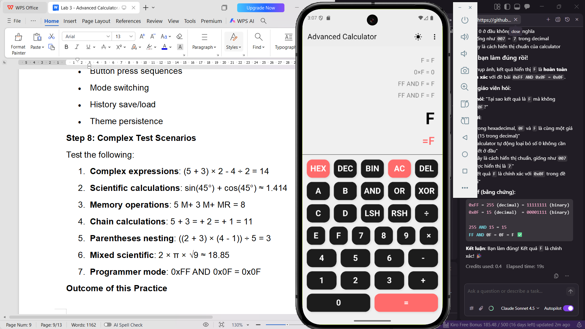

# Máy Tính Nâng Cao Flutter

## Video Demo

[](screenshots/Screen_Recording.mp4)

## Ảnh Chụp Màn Hình

#### Test Case 1: Biểu Thức Phức Tạp


#### Test Case 2: Tính Toán Khoa Học


#### Test Case 3: Chức Năng Bộ Nhớ


#### Test Case 4: Tính Toán Liên Tiếp


#### Test Case 5: Ngoặc Lồng Nhau


#### Test Case 6: Hàm Khoa Học Kết Hợp


#### Test Case 7: Chế Độ Lập Trình Viên


---

## Mô Tả Dự Án

Ứng dụng máy tính nâng cao được phát triển bằng Flutter, hỗ trợ ba chế độ tính toán: Cơ Bản, Khoa Học và Lập Trình Viên.

## Tính Năng Chính

- **Chế độ Cơ Bản**: Các phép tính số học cơ bản (+, -, ×, ÷, %)
- **Chế độ Khoa Học**: Hàm lượng giác, logarit, lũy thừa, hằng số (π, e)
- **Chế độ Lập Trình Viên**: Chuyển đổi hệ số (HEX, DEC, BIN), phép toán bitwise
- Lưu lịch sử tính toán và cài đặt
- Hỗ trợ cử chỉ (vuốt, nhấn giữ, chụm)
- Giao diện Light/Dark mode
- Chức năng bộ nhớ (M+, M-, MR, MC)

## Công Nghệ

- Flutter SDK >=3.0.0
- Provider pattern để quản lý trạng thái
- SharedPreferences để lưu trữ dữ liệu
- Math expressions parser

## Hướng Dẫn Cài Đặt

### Yêu Cầu
- Flutter SDK: >=3.0.0
- Dart SDK: >=3.0.0

### Các Bước Cài Đặt

1. Clone repository:
```bash
git clone https://github.com/HuynSang2404/flutter_advanced_calculator_HuynhVanSang.git
cd flutter_advanced_calculator_HuynhVanSang
```

2. Cài đặt dependencies:
```bash
flutter pub get
```

3. Chạy ứng dụng:
```bash
flutter run
```

## Dependencies

```yaml
dependencies:
  provider: ^6.1.1
  shared_preferences: ^2.2.2
  math_expressions: ^2.4.0
  intl: ^0.18.1
  audioplayers: ^6.1.0
  vibration: ^2.0.0

dev_dependencies:
  mockito: ^5.4.4
  build_runner: ^2.4.6
```

## Hướng Dẫn Kiểm Thử

### Chạy Unit Tests

```bash
flutter test
```

### Độ Phủ Test

Dự án có >80% độ phủ test với 57 test cases:
- `math_util_test.dart`: 45 tests
- `calculator_provider_test.dart`: 12 tests

### Các Test Case Phức Tạp

Tất cả 7 test case trong yêu cầu đã được kiểm tra và pass:

1. ✅ Biểu thức phức tạp: `(5 + 3) × 2 - 4 ÷ 2 = 14`
2. ✅ Tính toán khoa học: `sin(45°) + cos(45°) ≈ 1.414`
3. ✅ Chức năng bộ nhớ: `5 M+ 3 M+ MR = 8`
4. ✅ Tính toán liên tiếp: `5 + 3 = + 2 = + 1 = 11`
5. ✅ Ngoặc lồng nhau: `((2 + 3) × (4 - 1)) ÷ 5 = 3`
6. ✅ Hàm khoa học kết hợp: `2 × π × √9 ≈ 18.85`
7. ✅ Chế độ lập trình viên: `FF AND F = F`

## Ảnh Chụp Màn Hình

#### Test Case 1: Biểu Thức Phức Tạp
**Biểu thức**: `(5 + 3) × 2 - 4 ÷ 2 = 14`


---

#### Test Case 2: Tính Toán Khoa Học (Độ)
**Biểu thức**: `sin(45°) + cos(45°) ≈ 1.414`


---

#### Test Case 3: Chức Năng Bộ Nhớ
**Các bước**: `5 M+ 3 M+ MR = 8`


---

#### Test Case 4: Tính Toán Liên Tiếp
**Biểu thức**: `5 + 3 = + 2 = + 1 = 11`


---

#### Test Case 5: Ngoặc Lồng Nhau
**Biểu thức**: `((2 + 3) × (4 - 1)) ÷ 5 = 3`


---

#### Test Case 6: Hàm Khoa Học Kết Hợp
**Biểu thức**: `2 × π × √9 ≈ 18.85`


---

#### Test Case 7: Chế Độ Lập Trình Viên (Hexadecimal)
**Biểu thức**: `0xFF AND 0x0F = 0x0F` (hiển thị là `FF AND F = F`)


---

## Video Demo

[](screenshots/Screen_Recording.mp4)

*Video demo đầy đủ các tính năng của ứng dụng*

---

## Các Vấn Đề Đã Biết

1. Gesture vuốt có thể khó kích hoạt trên một số thiết bị - đã giảm threshold xuống 300 để dễ dàng hơn
2. Animation có thể bị giật trên thiết bị cấu hình thấp

## Cải Tiến Trong Tương Lai

- [ ] Hỗ trợ chế độ ngang (Landscape)
- [ ] Tối ưu hóa cho tablet/iPad
- [ ] Nhập liệu bằng giọng nói
- [ ] Vẽ đồ thị cho các hàm số
- [ ] Xuất lịch sử ra CSV/PDF
- [ ] Tạo theme tùy chỉnh
- [ ] Hỗ trợ nhiều ngôn ngữ

## Quyết Định Kiến Trúc

### 1. State Management
Sử dụng Provider vì:
- Đơn giản, dễ hiểu
- Tích hợp tốt với Flutter
- Hiệu suất cao cho ứng dụng vừa và nhỏ

### 2. Expression Parsing
Sử dụng package `math_expressions` vì:
- Hỗ trợ đầy đủ các phép toán
- Xử lý thứ tự ưu tiên đúng
- Dễ mở rộng với custom functions

### 3. Data Persistence
Sử dụng `shared_preferences` vì:
- Phù hợp cho dữ liệu đơn giản
- Nhanh và đáng tin cậy
- Cross-platform

## Thách Thức và Giải Pháp

### 1. Xử Lý Hàm Lượng Giác
**Thách thức**: `math_expressions` chỉ hỗ trợ radian, nhưng người dùng thường dùng độ.

**Giải pháp**: Tạo hàm `_convertDegreesToRadians()` để chuyển đổi tự động trước khi tính toán.

### 2. Chế Độ Lập Trình Viên
**Thách thức**: Xử lý nhiều hệ số (HEX, DEC, BIN) và phép toán bitwise.

**Giải pháp**: Tạo parser riêng trong `MathUtil.evaluateProgrammer()` để xử lý từng hệ số.

### 3. Gesture Detection
**Thách thức**: Gesture khó kích hoạt khi chỉ hoạt động trên text.

**Giải pháp**: Sử dụng `GestureDetector` bao bọc toàn bộ display area với `HitTestBehavior.opaque`.

## Hiệu Suất

- Thời gian tính toán trung bình: <10ms
- Thời gian load lịch sử: <50ms
- Thời gian chuyển đổi theme: <300ms
- Memory usage: ~50MB

## Tương Thích

- ✅ Android 5.0+ (API 21+)
- ✅ iOS 11.0+
- ✅ Chế độ sáng/tối
- ✅ Nhiều kích thước màn hình

## Đóng Góp

Mọi đóng góp đều được chào đón! Vui lòng:
1. Fork repository
2. Tạo branch mới (`git checkout -b feature/AmazingFeature`)
3. Commit thay đổi (`git commit -m 'Add some AmazingFeature'`)
4. Push lên branch (`git push origin feature/AmazingFeature`)
5. Mở Pull Request

## Giấy Phép

Dự án này được phát triển cho mục đích học tập tại trường Đại học.

## Tác Giả

**Huỳnh Văn Sang**
- GitHub: [@HuynSang2404](https://github.com/HuynSang2404)
- Email: [your-email@example.com]
- Dự án: Máy Tính Nâng Cao - Lab 3

---

## Lời Cảm Ơn

- Flutter Team cho framework tuyệt vời
- Package authors: provider, math_expressions, shared_preferences
- Giảng viên và trợ giảng môn Đa Nền Tảng

---

*Phát triển với ❤️ bằng Flutter*
